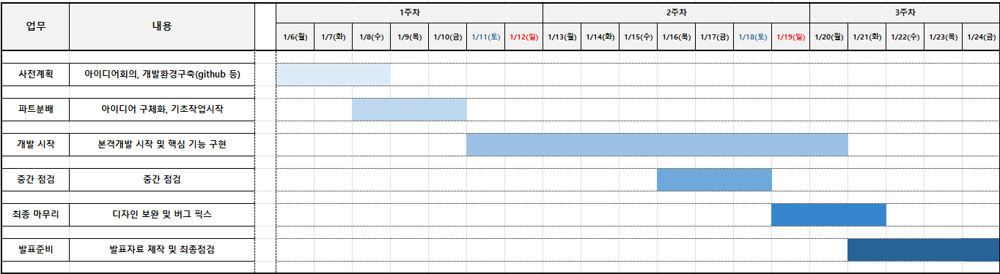
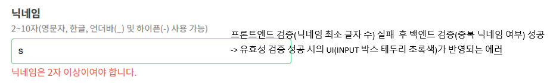

# 오늘의 집 클론 Project

💡 프로젝트 개요: 사용자들이 자신의 인테리어 디자인을 공유하고 자랑할 수 있는 플랫폼을 만드는 프로젝트

## 1. Git Repository
📁 https://github.com/home-decor-202501/home-decor

## 2. 프로젝트 기간: 25/01/06 ~ 25/01/24

## 3. 👥 프로젝트 멤버 및 역할
#### 1) 김미정 (팀장)  
- 역할: 회원가입/로그인 페이지 개발, Github 세팅, GitHub ReadMe 작성

#### 2) 오인혁 
- 역할: 게시글 상세보기 페이지 개발, ERD 작성, 프로젝트 발표

#### 3) 윤희원 
- 역할: 메인페이지 개발, 게시글 쓰기 페이지 개발

#### 4) 박찬의  
- 역할: 내 글 보기 페이지
    

## 4. ⚙️ Tech Stack with Too

#### Frontend Technologies

#### Backend Technologies

#### Database

#### Libraries
-E6A400?style=flat&logo=yup&logoColor=white)

#### Development Tools

#### Operating Systems

#### Version Control

#### Communication Tools

## 5. 📸 시연
####  1) 📝 회원가입 페이지(김미정)
- 사용자 경험(ux) 에 초점을 둔 회원가입 페이지 
  (페이지 로드 시 첫번째 입력필드로
  자동 이동, 실시간 입력정보 유효성 검사, Caps Lock 감지, 회원가입에 실패할 시
  입력값 오류 발생 필드로 자동 이동) 
  
   

#### 2) 🔑️‍ 로그인 페이지(김미정)
- 사용자 경험(ux) 에 초점을 둔 로그인 
  (이전 로그인 아이디 자동 저장, 로그인 실패 시
  비밀번호 설정 조건 알림, Caps Lock 감지, 로그인에 실패할 시
  입력값 오류 발생 필드로 자동 이동) 
  
   

#### 3) 🏠 메인 페이지(윤희원)

 

#### 4) ✍️ 게시글 쓰기 페이지(윤희원)

 

#### 5) 📋 게시글 상세보기 페이지(오인혁)
 

## 6. ✅ 트러블 슈팅
**[회원가입(김미정)]** 
🔍 문제점 : 회원 가입 시 유효성 검증 결과에 각 입력필드(이메일, 닉네임, 비밀번호 필드)의 UI를 업데이트 하고자 하였는데, 프론트와 백엔드 각각 나누어서 순서대로 검증이 이루어지다보니 프론트 검증 실패 후 백엔드 검증 성공 시 검증 성공 시의 UI가 반영되는 문제
 
  
💡 해결방안 : 프론트엔드와 백엔드 각각에서 유효성 검사 실패 시 input 태그에 error 클래스 붙임 
&nbsp;&nbsp;&nbsp;&nbsp;&nbsp;&nbsp;&nbsp;&nbsp; &nbsp;&nbsp;&nbsp;&nbsp;  &nbsp;&nbsp;&nbsp;&nbsp;&nbsp;&nbsp;&nbsp;&nbsp;→ 백엔드 유효성 검사까지 끝난 후, error 클래스가 붙은 input 태그와 그렇지 않은 태그로 구분하여 UI 업데이트
  
**[(오인혁)]** 
🔍 문제점 :  
💡 해결방안 :
  
**[(윤희원)]** 
🔍 문제점 :  
💡 해결방안 :
  

## 7. 🧠️ 느낀 점
**[김미정]** 
- 개발 진행 속도가 더디어 정작 중요한 기능(아이디/비밀번호 찾기, 회원가입 시 이메일 인증, 소셜로그인)은 개발하지 못해서 아쉬움  
- 유효성 검증 라이브러리(yup)를 써보면서, 처음 써보는 라이브러리의 사용 방법을 스스로 익혀보는 시간을 가진 것은 유의미했음  

**[오인혁]** 
-   

**[윤희원]** 
-  
